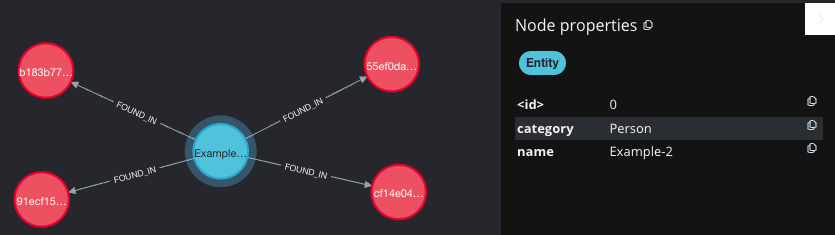

# Neo4j with Kafka Streaming

## Overview

A simple network integrating Neo4j with Kafka. This configuration has been tested 
on Apple M2 silicon. Other setups may need to use a different Neo4j docker base image.

This example simulates an NLP application where Named Entities have been extracted 
from text and stored in a Graph Database. The following data model is used:



Readers are directed to the official [Neo4j](https://github.com/neo4j-contrib/neo4j-streams/tree/master/kafka-connect-neo4j/docker) repo for a full walkthrough. 

The docker compose will create the following containers:

container|Exposed ports
---|---
neo4j|7474 7687
kafka|29092
kafka-connect|8083
zookeeper|22181

## Installation
The following steps will set up the network and generate example data:

### Pre-requisites
- Docker
- Docker-compose

### Docker compose
To run the network in detached mode use the ```-d```flag at the end of the command:  
```shell
docker-compose up
```

### Configure Neo4j
Once the network is up and running, POST the configuration file to the kafka-connect 
container. This contains the details of the incoming message and how it is loaded into 
Neo4j. See the [config](neo4j-stream/contrib.sink.string-json.neo4j.json) file for the full 
details but the following lines are highlighted for importance:

```json lines
{
  "name": <name of connector>,
  "config": {
    "topics": <name of subscribed topic>,
    "neo4j.topic.cypher.<name of subscribed topic>": <cypher statement to add new nodes and relationships>
  }
}
```

A [script](neo4j-stream/neo_4j_config.sh) has been provided which automates this step.

### Validate setup

To validate the setup of the cluster example producer and consumer scripts have been provided. 
Install the virtual environment and run both scripts in separate terminal windows.

```shell
python3 -m venv venv
source venv/bin/activate
pip3 install -r requirements.txt
python3 <name of file>
```
